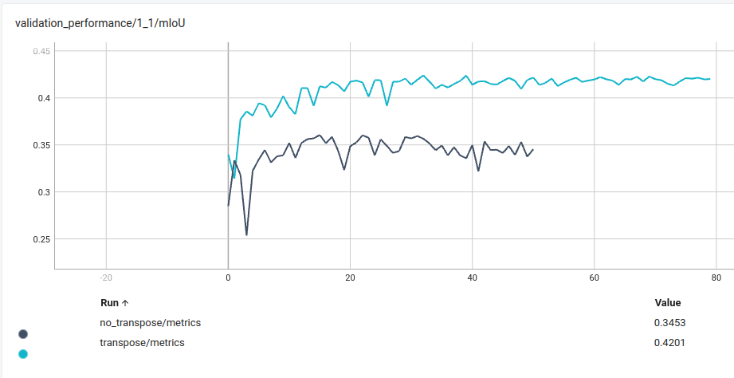

# Набор скриптов для проекции вокселей в 2d

В папке vox2bev содержатся скрипты для проекции в 2d и работы с semantic kitti

В папке pc2bev содержатся скрипты для работы с нашими облаками точек

## Проекция в 2D

Здесь собраны скрипты, которые я использовал для проекции вокселей semantic-kitti в 2d. Возможно, некоторые
операции будут специфичны только для этого датасета, так как неясно, как будут храниться/загружаться воксели в
других датасетах.

## Что здесь есть

* `lib/core/projection.py`, `lib/core/projection_torch.py` - собственно содержат функции для проекции для numpy и torch
* `scripts/project_dataset.py` - скрипт для проекции Semantic-kitty
* `scripts/check_projection.py` - скрипт для проверки проекции. Рисует точки какого-то класса на проекции. 
Координаты точек берутся из вокселей.
* `config` - конфиги semantic-kitti, в том числе переделанный под наши классы
  

## Тонкие моменты
В первую очередь советую обратить внимание на эти строки:

* [транспонирование bev](./lib/core/projection.py#L40). Если посмотреть результаты `check_projection.py`, без него точки из вокслей
  рисуются не на своих местах. Также приведу здесь метрики из эксперимента обучения LMSCNet
  
* [учёт невалидных лейблов](./scripts/project_dataset.py#L183). Присваиваем им особый лейбл, который потом обрабатывается
  во время обучения. Я пока так сделал.

## Как получить 2d проекцию из наших данных

To save new .pcd which consists of many point clouds modify scripts/pcd_multisweep.py (fill in pcd_paths and pose_paths) and run
```bash
git clone <project2d-git-repo>
cd project2d
python3 -m scripts.pcd_multisweep --grid -25 -25 -2 25 25 5 --voxel 0.4 --json <path-to-json> --pcd <path-to-pcd> \
    --viz  # if needed
```

## Как берётся crop во время подсчёта miou статики относительно нашей размеченной валидации
Тула сбора статики выдаёт статику заданного радиуса на картинке заданного размера. Надо задать радиус 51.2 метра 
и размер всей картинки в 512 пикселей. В итоге остаётся отсечь левую половину и взять серединку по y.

```
h, w = img_pred.shape[:2]  # 512, 512
img_pred = img_pred[h // 4:(3 * h) // 4, w // 2:]  # 256, 256, kitti grid
img_pred = np.flip(img_pred, axis=0)  # flip for consistency with existing gt
```

Визуально это выглдит так (чёрная рамка - картинка из тулы статики, зелёная - то что берётся для сравнения с разметкой):


Ветка в sda для сбора новой статики под валидацию https://gitlab.sberautotech.ru/sd/SDA/-/tree/f/CSD-44423-new-statics-rebase?ref_type=heads

Ветка в sda для сбора старой статики под валидацию https://gitlab.sberautotech.ru/sd/SDA/-/tree/f/CSD-44423-old-statics-rebase?ref_type=heads 

Разметка с которой сравнивается статика https://lakefs.cs.navio.auto/repositories/occupancy-datasets/objects?path=navio-markup%2F&ref=main 